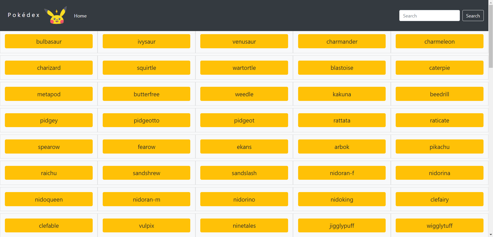

# Pokemon App

## About
This is a Pokédex App built with HTML, CSS and Javascript that loads data from an external API. When each pokemon button is clicked, the image and the height of the Pokemon appears on a modal. The search bar is not working yet but very soon this option will be added then pokemons can be searched by typing their name. This modal can then be closed by clicking on the close (x) button, pressing the escape key or clicking outside the modal. The app is resoponsive for different screen layouts.

## App dependencies
- jQuery
- Bootstrap
- Pokémon [API](https://pokeapi.co/)
- Ajax

#### Autor
[GitHub](https://github.com/BJaguar71)
